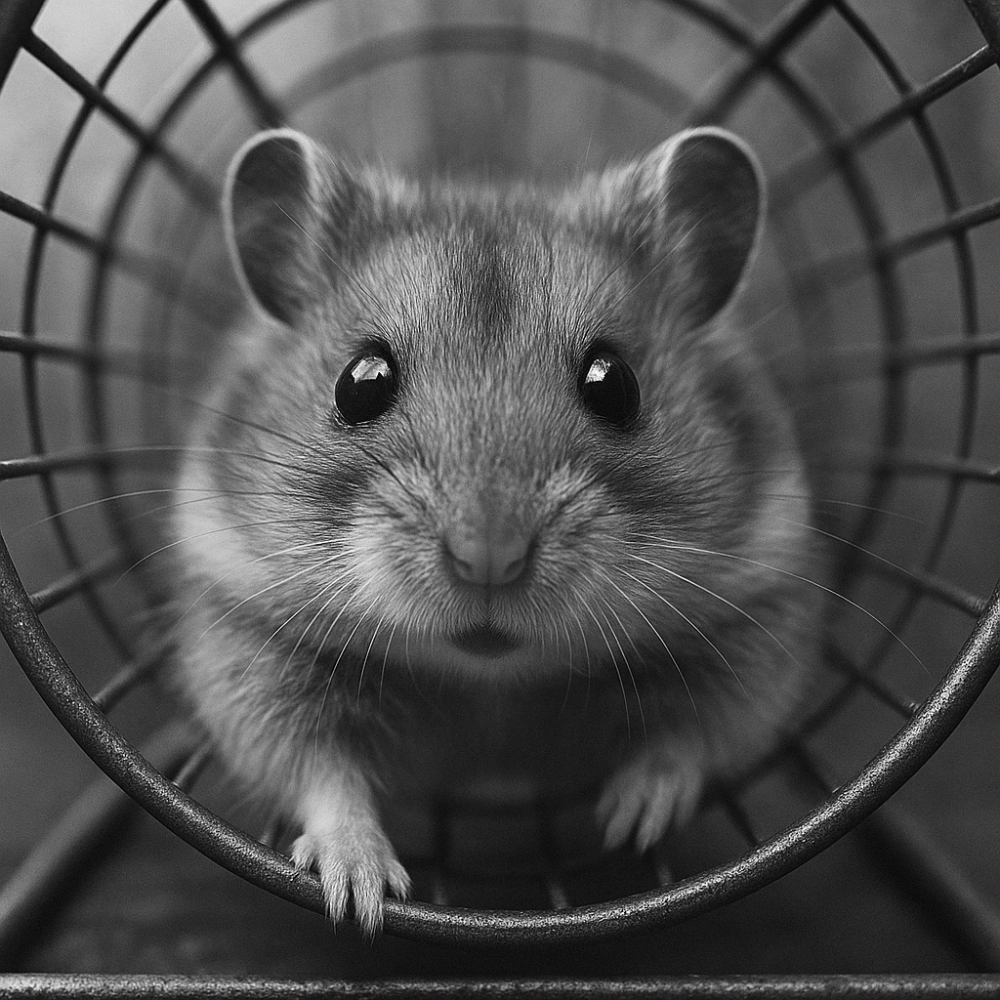

Hamster Wheel Perspective Test
## Prompt
A black-and-white photograph. The viewer is one inch in front of a hamster’s face as it runs inside a hamster's exercise wheel. The perspective is dynamic and physically grounded, the viewer’s position should be fixed on the inside of the wheel, directly facing the hamster’s motion as it runs towards the camera. The wheel's curvature and vanishing lines should follow the perspective.

## Result

## Evaluation
Despite the explicit instruction to fix the camera viewpoint just ahead of the hamster’s face, the model rendered the scene from an external or misaligned angle, failing to simulate a consistent first-person viewpoint inside the spinning wheel.

There is no clear depiction of the inner curvature, dynamic vanishing lines, or depth cues that would anchor the hamster in a coherent 3D space. The image exhibits pattern recall (e.g., centered hamster, flat surfaces) rather than simulating the requested geometric framing.

## Takeaway
The model fails to render a consistent 3D perspective despite explicit prompt instructions involving fixed viewpoint and depth. There is no foreshortening or distortion expected from a close-range angle, instead, the output flattens the scene into a 2D lateral layout.

This suggests the model is reasoning in a 2D image space (X and Y), without a true Z-axis for depth. It assembles learned visual patterns rather than constructing scenes from a coherent spatial viewpoint. This limitation becomes especially visible when prompts imply grounded camera geometry, occlusion, or physical orientation in space.
